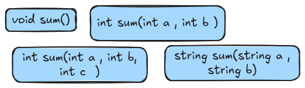

## NOTE for final reviews 
Date: 02-April

OOP , there are 4 principle 
1. **Encapsulation** 
    - wraping, binding, bundling all data ( function + data membeer) to a single unit ( Class )
    - data hiding: 
    - read/write = getters / setters 
2. **Inheritance** 
    - A ways that one class can inherit the properties(data member , function member ) from other class
    - Code Reusability 

    - Person , Student, Worker, Employer , Employee
    - Used to achieved Runtime Polymorphism  
3. Polymorphism: 
=> Greek ( poly = many, morph, morphism = form )
=> Result = Many Forms 

**There two type of polymorphism** 
1. Compile-time Polymorphism (Function overload)
2. Runtime Polymorphism (Function override)

**Diff. Overload vs Override**
a. Override ( Over + write , rewrite, ....)

- Ram ( heap ,stack )
- Class obj  = new Class(); 
- Class* obj = new Class(); 

- `new` : allocate 
- `delete` : deallocate

b. **Overload** (Keeping the same name but different parameters, returntype, number of parameters)

Compile -> Run

4. **Abstraction** 
- Hide complex implementation,  easy for code maintainance 

In order to achieve abstraction, we have two 
1. **Abstract Class**
a class that contains at least one pure virtual function  
2. **Interface** 
all function must be a pure virutal function 

Loosely Coupling vs Tightly Coupling 
